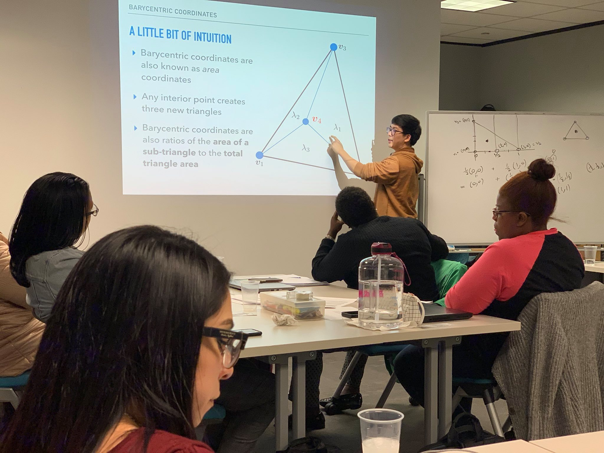

Our group focuses on computational mechanics and the efficient numerical solution of time-dependent partial differential equations. Recent work in this group has focused on provably stable and high order accurate methods for time-dependent wave propagation and fluid dynamics, as well as their efficient implementation on Graphics Processing Units (GPUs). 

We gratefully acknowledge the support of the NSF (DMS-1719818 and DMS-1712639) in making this work possible.

## Recent news:

* January 2020: Jesse Chan received an [NSF CAREER award](https://www.nsf.gov/awardsearch/showAward?AWD_ID=1943186) from the Division of Mathematical Sciences Comp. Math program.
* January 2020: Jesse Chan gave a talk at the R-STEM/ConocoPhillips Applied Mathematics Program (AMP!) on "Applications of K-12 geometry and algebra:barycentric coordinates". More information [here](https://www.facebook.com/RiceCAAM/posts/2763081467106010).

* January 2020: Jesse Chan gave a talk at the University of Houston Dept. of Mathematics. 
* December 2019: Jesse Chan gave a talk at the University of Toronto Institute of Aerospace (UTIAS).
* November 2019: graduate students Kaihang Guo and Philip Wu presented work on wave propagation in acoustic-elastic media and entropy stable schemes for the shallow water equations at the SIAM LA-TX sectional meeting in Dallas, TX.
* October 2019: our paper ["A weight-adjusted discontinuous Galerkin method for the poroelastic wave equation: penalty fluxes and micro-heterogeneities"](https://www.sciencedirect.com/science/article/pii/S0021999119307661) has been accepted to the Journal of Computational Physics.
* September 2019: our preprint "Entropy stable reduced order modeling of nonlinear conservation laws" is available as an [arXiv preprint](https://arxiv.org/abs/1909.09103).
* September 2019: Jesse Chan gave a talk to the Computational and Applied Mathematics group at ORNL in Oak Ridge, TN. 
* August 2019: our paper ["Skew-symmetric entropy stable modal discontinuous Galerkin formulations"](https://arxiv.org/abs/1902.01828) was accepted to the Journal of Scientific Computing.
* July 2019: Jesse Chan and Kaihang Guo give talks at USNCCM 2019 in Austin, TX.
* July 2019: our paper ["Efficient entropy stable Gauss collocation methods"](https://arxiv.org/abs/1809.01178) was accepted to the SIAM Journal on Scientific Computing.
* July 2019: Jesse Chan gave a talk at ICIAM 2019 in Valencia, Spain.
* June 2019: Jesse Chan gave a talk at the R-STEM ConocoPhillips Applied Mathematics Program (AMP!).
* June 2019: Jesse Chan gave a talk at NAHOM 2019 in San Diego, CA.
* May 2019: our preprint "A weight-adjusted discontinuous Galerkin method for wave propagation in coupled elastic-acoustic media" is available as an [arXiv preprint](https://arxiv.org/abs/1905.09145), and introduces a new provably stable high order DG methods for wave propagation in coupled acoustic-elastic media. As with previous weight-adjusted DG papers, the method is time-explicit, high order accurate, and applicable to sub-cell micro heterogeneities, anisotropic media, and curved meshes.
* April 2019: Jesse Chan gave a talk at the GMIG project review.
* April 2019: our preprint "A weight-adjusted discontinuous Galerkin method for the poroelastic wave equation: penalty fluxes and micro-heterogeneities" is available as an [arXiv preprint](https://arxiv.org/abs/1904.02578). We introduce provably stable high order DG methods for wave propagation in poroelastic media. Attractive features of the scheme include resolution of sub-cell micro-heterogeneities and simple upwind-like penalty flux terms.


* February 2019: our preprint "Skew-symmetric entropy stable modal discontinuous Galerkin formulations" is as an [arXiv preprint](https://arxiv.org/abs/1902.01828). We construct DG formulations which retain entropy stability under relaxed quadrature accuracy, which are applicable to hybrid meshes with mixed element types. 
* September 2018: our preprint "Efficient entropy stable Gauss collocation schemes" is available as an [arXiv preprint](https://arxiv.org/abs/1809.01178). Entropy stable collocation-DG schemes on tensor product elements typically utilize Gauss-Lobatto quadratures. We extend entropy stable collocation schemes to more accurate Gauss quadratures, which improve error significantly on curved meshes. 
* September 2018: our preprint "Leapfrog Time-stepping for Hermite methods", which describes a high order extension of the well-known Yee-scheme for time-domain wave propagation, is available as an [arXiv preprint](https://arxiv.org/abs/1808.10481). 
* August 2018: Kaihang Guo successfully defended his MA thesis on low-complexity GPU-accelerated DG methods for wave propagation in media with sub-cell heterogeneities. This work is available online in an [arXiv preprint](https://arxiv.org/abs/1808.08645).
* August 2018: Jesse Chan is featured in the CAAM [video](https://www.youtube.com/watch?v=lMfHpvXGPAY) for the School of Engineering.
* June 2018: our paper on [discretely entropy stable DG methods](https://www.sciencedirect.com/science/article/pii/S0021999118301153) is now online. We show how to generalize the construction of discretely entropy stable methods to ``modal'' DG formulations. The resulting formulations extend semi-discrete entropy stability theory to arbitrary bases and standard finite element quadrature rules.
* May 2018: our paper on [explicit time-stepping isogeometric methods](https://www.sciencedirect.com/science/article/pii/S0045782518300240) is now online. In this paper, we show how to efficiently combine isogeometric finite elements with explicit time-stepping while avoiding the inversion of a dense mass matrix. These methods also have the advantage of a better CFL constant at high orders of approximation.
* Jan 2018: Kaihang Guo receives the [K2i fellowship](https://caamweb.rice.edu/news/k2i-fellowships-2017) from the Ken Kennedy Institute.
* Jan 2018: our paper on [provably stable DG methods for elasticity with sub-cell heterogeneities](https://onlinelibrary.wiley.com/doi/abs/10.1002/nme.5720) is available online. This work extends the "weight-adjusted mass matrix" (generalized mass lumping) to matrix-valued weights and applies it to elastic wave propagation. By factoring material coefficients into the mass matrix, we simplify the formulation of stable DG methods for both isotropic and anisotropic media.

