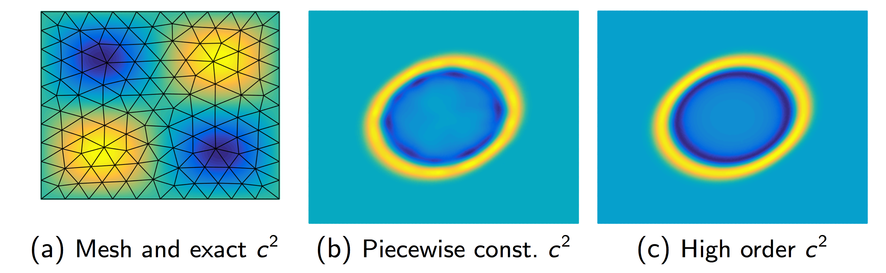

Our research focuses primarily on high order numerical methods for both linear and nonlinear hyperbolic partial differential equations (PDEs) which are provably reliable and efficient. A significant advantage of high order methods for time-dependent hyperbolic PDEs is their low numerical dispersion and dissipation compared to low order methods, which allows for the high-fidelity propagation of waves, vortices, and subgrid features over long time and length scales. 

Most of our work falls into three main areas: 
- [Computational fluid dynamics](#entropy-stable-methods-for-nonlinear-conservation-laws)
- [Wave propagation in complex heterogeneous media](#efficient-high-order-methods-for-wave-propagation)
- [Finite element methods on hybrid meshes](#finite-element-methods-on-hybrid-meshes)

You can find a complete list of publications on my [Google Scholar page](https://scholar.google.com/citations?user=nA29Z5YAAAAJ&hl=en/), or on my [CV](../files/jcv.pdf). Selected preprints are also available on arXiv under "Jesse Chan".

## Entropy stable methods for nonlinear conservation laws

Nonlinear conservation laws govern the behavior of fluid phenomena such as compressible or shallow water flows. Numerical simulations of such phenomena are sensitive to problems of instability. For low order methods, this instability can be offset by the presence of numerical dissipation, which decreases accuracy but has a stabilizing effect on simulations.  However, the low numerical dissipation of high order methods becomes a double-edged sword, reducing robustness and rendering many high order discretizations unstable without additional regularization such as artificial viscosity, slope limiting, or filtering. This regularization is typically ad-hoc and can reduce accuracy. 

Discretely entropy stable methods aim to restore stability while maintaining high order accuracy by ensuring that numerical solutions satisfy a physically consistent entropy inequality. This entropy inequality serves as a generalization of the conservation or dissipation of energy to nonlinear PDEs, and ensures that the numerical solution does not blow up so long as the solution is physical (e.g. positive density, pressure). 

Below is a plot of density at times .3 and .7 for a horizontally periodic version of a compressible inviscid weak shock-vortex interaction from [Shu (1998)](https://ntrs.nasa.gov/archive/nasa/casi.ntrs.nasa.gov/19980007543.pdf). The solution is computed using an entropy stable method on a quadrilateral mesh of 100-by-50 elements of polynomial degree 4. No regularization is applied apart from a consistent [interface dissipation](https://www.sciencedirect.com/science/article/pii/S0021999116306477), yet the solution remains stable in the presence of the shock. 

### Selected relevant papers:

- [On discretely entropy conservative and entropy stable discontinuous Galerkin methods](https://www.sciencedirect.com/science/article/pii/S0021999118301153)
- [Discretely entropy stable weight-adjusted discontinuous Galerkin methods on curvilinear meshes](https://arxiv.org/abs/1805.10934)

[Back to top](#top)

## Efficient high order methods for wave propagation

Simulations of wave propagation in complex heterogenous media arise in applications such as earthquake predicition or geophysical or medical tomography. High order methods are popular due to their high fidelity resolution of propagating waves; however, the computational cost of finite element and DG methods at high polynomial degrees discourages the use of very high orders of approximation. 

One challenge for high order DG methods is the efficient, stable, and accurate incorporation of media heterogeneities which vary spatially at the sub-cell level. It is difficult to construct approaches address all three requirements simultaneously. Our main achievement in this area was the introduction and analysis of a technique to incorporate sub-cell variations as weights within an easily invertible and high order accurate "weight-adjusted mass matrix", which can be interpreted as a generalization of mass lumping to more general types of elements. As seen below, high order DG methods which use a piecewise constant approximation of heterogeneous media produce spurious reflections. These reflections vanish upon switching to a high order representation of media.

This approach has been extended to "matrix-valued" weights, with applications in elastic and poroelastic wave propagation.  We have also utilized weight-adjusted mass matrices to construct efficient and provably stable high order DG schemes on curved simplicial meshes, as well as on quadrilateral and hexahedral meshes for multi-patch DG isogeometric analysis. On tensor product elements, Weight-adjusted mass matrices provide the additional benefit of re-exposing a Kronecker product structure which is lost when using a standard weighted finite element mass matrix.

### Selected relevant papers:
- [Weight-adjusted discontinuous Galerkin methods: wave propagation in heterogeneous media](https://epubs.siam.org/doi/abs/10.1137/16M1089186)
- [Weight-adjusted discontinuous Galerkin methods: curvilinear meshes](https://epubs.siam.org/doi/abs/10.1137/16M1089198)
- [Weight‐adjusted discontinuous Galerkin methods: matrix‐valued weights and elastic wave propagation in heterogeneous media](https://onlinelibrary.wiley.com/doi/abs/10.1002/nme.5720)
- [Multi-patch discontinuous Galerkin isogeometric analysis for wave propagation: Explicit time-stepping and efficient mass matrix inversion](https://www.sciencedirect.com/science/article/pii/S0045782518300240)

Our group has also addressed computational costs for high order DG methods by reformulating the method in terms of Bernstein-Bezier polynomials (shown below), for which there exist yield low-complexity algorithms for the two major computational steps in DG (computing volume and surface contributions). For a degree 4 approximation with piecewise constant media, this yields roughly a two times speedup over a competitive [nodal DG](https://www.springer.com/us/book/9780387720654) code.  This increases to a six-fold speedup for a degree 9 approximation. We have also introduced a low-complexity Bernstein-Bezier version of the weight-adjusted DG method for sub-cell heterogeneities. 


       


### Selected relevant papers: 

- [Bernstein-Bezier weight-adjusted discontinuous Galerkin methods for wave propagation in heterogeneous media](https://arxiv.org/abs/1808.08645)
- [GPU-accelerated Bernstein-Bezier discontinuous Galerkin methods for wave problems](https://epubs.siam.org/doi/abs/10.1137/15M1053542)

[Back to top](#top)

## Finite element methods on hybrid meshes 

The use of unstructured meshes with finite element methods enables simulations of physical phenomena on complex geometries. However, not all meshes are equivalent. For example, while tetrahedral mesh generation tends to be more geometrically flexible, the use of hexahedral meshes can improve the efficiency of simulations by, for example, exposing a tensor product structure over each element. Hybrid meshes, which contain both hexahedral and tetrahedral elements, as well as transitional prismatic and pyramidal elements, make it possible to harness the advantages of both hexahedral and tetrahedral element types. 

While it is generally straightforward to construct high order finite element spaces on hexahedral, tetrahedral, and prismatic elements, constructing high order finite elements on pyramids poses more of a challenge. We have extended several aspects of high order tetrahedral finite elements to pyramids. Combined with discretely energy stable DG formulations for wave propagation problems, these tools have enabled robust, efficient, and accurate GPU-accelerated simulations on unstructured hybrid meshes. 

### Selected relevant papers: 

- [GPU-accelerated discontinuous Galerkin methods on hybrid meshes](https://www.sciencedirect.com/science/article/pii/S0021999116300353)
- [A short note on a Bernstein-Bezier basis for the pyramid](https://epubs.siam.org/doi/abs/10.1137/15M1036397?journalCode=sjoce3)
- [Orthogonal bases for vertex-mapped pyramids](https://epubs.siam.org/doi/abs/10.1137/15M1011408)
- [A comparison of high order interpolation nodes for the pyramid](https://epubs.siam.org/doi/abs/10.1137/141000105)

[Back to top](#top)




- [hp finite element trace inequalities for the pyramid](https://www.sciencedirect.com/science/article/pii/S0898122115000358)


  




Our research focuses on computational mechanics and the efficient numerical solution of partial differential equations. Recent work in this group has focused on accurate high order methods for time-dependent wave propagation and fluid dynamics, as well as their efficient implementation on Graphics Processing Units (GPUs). 


