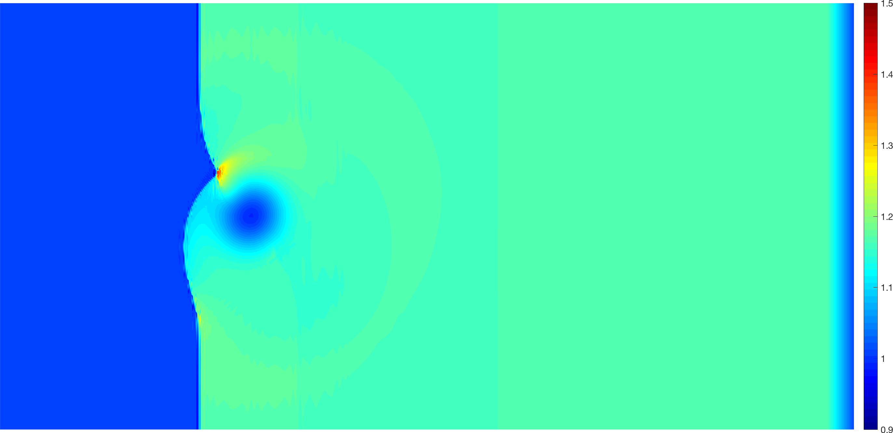
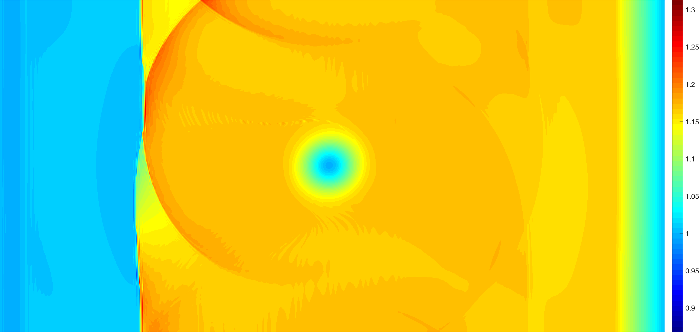

Our research focuses primarily on high order numerical methods for both linear and nonlinear hyperbolic partial differential equations (PDEs) which are provably reliable and efficient. A significant advantage of high order methods for time-dependent hyperbolic PDEs is their low numerical dispersion and dissipation compared to low order methods, which allows for the high-fidelity propagation of waves, vortices, and subgrid features over long time and length scales. 

Our work focuses on four main areas: 
- [**Nonlinear conservation laws**](#entropy-stable-methods-for-nonlinear-conservation-laws)
- [**Wave propagation in heterogeneous media**](#efficient-high-order-methods-for-wave-propagation)
- [**Simulations on curved geometries**](#efficient-high-order-dg-methods-on-curved-meshes)
- [**DG methods on unstructured hybrid meshes**](#high-order-dg-methods-on-hybrid-meshes)

You can find a complete list of publications on my [**Google Scholar page**](https://scholar.google.com/citations?user=nA29Z5YAAAAJ&hl=en/), or on arXiv under "Jesse Chan". 

### Entropy stable methods for nonlinear conservation laws

Nonlinear conservation laws govern the behavior of fluid phenomena such as compressible or shallow water flows, and are sensitive to problems of instability. For low order methods, this instability can be offset by the presence of numerical dissipation, which decreases accuracy but has a stabilizing effect on simulations.  The low numerical dissipation of high order methods, however, becomes a double-edged sword, rendering many high order methods unstable without additional regularization such as artificial viscosity, slope limiting, or filtering. These regularization approaches are typically ad-hoc and can reduce accuracy. 

Discretely entropy stable methods aim to restore stability while maintaining high order accuracy by ensuring that numerical solutions satisfy a semi-discrete entropy inequality. This entropy inequality serves as a generalization of  conservation or dissipation of energy, and ensures that the numerical solution does not blow up so long as the solution is physical (e.g. positive density, pressure). 

Below is a horizontally periodic version of a compressible inviscid weak shock-vortex interaction from [Shu 1998](https://ntrs.nasa.gov/archive/nasa/casi.ntrs.nasa.gov/19980007543.pdf) using an entropy stable method on a quadrilateral mesh of 100-by-50 elements of polynomial degree 4. No regularization is applied apart from a consistent [interface dissipation](https://www.sciencedirect.com/science/article/pii/S0021999116306477), yet the solution remains stable in the presence of the shock. 

Relevant papers
- ESDG Gauss preprint
- ESDG curved
- ESDG

[*Back to top*](#top)

### Efficient high order methods for wave propagation

- BBWADG
- Elastic WADG media
- WADG heterogeneous media
- BBDG

[*Back to top*](#top)

### Efficient high order DG methods on curved meshes

- WADG curved
- BIDG
- IGA-DG

[*Back to top*](#top)

### High order DG methods on hybrid meshes 

Appropriate choices of basis

- Hybridg
- BBPyr
- Orthogonal pyr basis.
- Pyr nodes

[*Back to top*](#top)





  




Our research focuses on computational mechanics and the efficient numerical solution of partial differential equations. Recent work in this group has focused on accurate high order methods for time-dependent wave propagation and fluid dynamics, as well as their efficient implementation on Graphics Processing Units (GPUs). 


